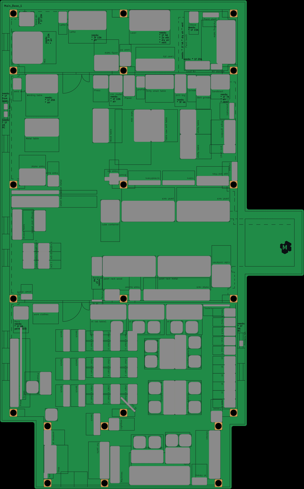
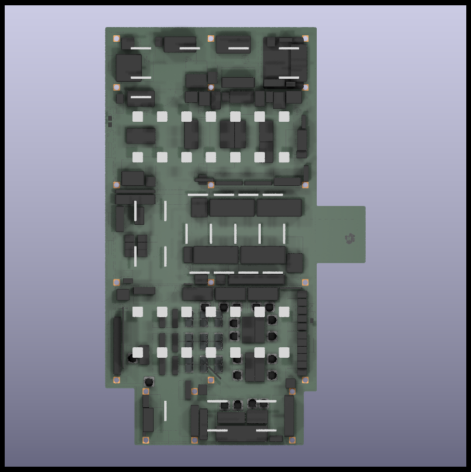

Kaunas Makerspace - base v5.0 

Dev NOTE: before commit, run `./kibot.sh` to regenerate documentation, gerbers and other assets.

* [main base items](gen/main_items.pdf)
* [main base floorplan](gen/main_floorplan.pdf)
* [storage items](gen/storage_items.pdf)
* [storage floorplan](gen/storage_floorplan.pdf)

